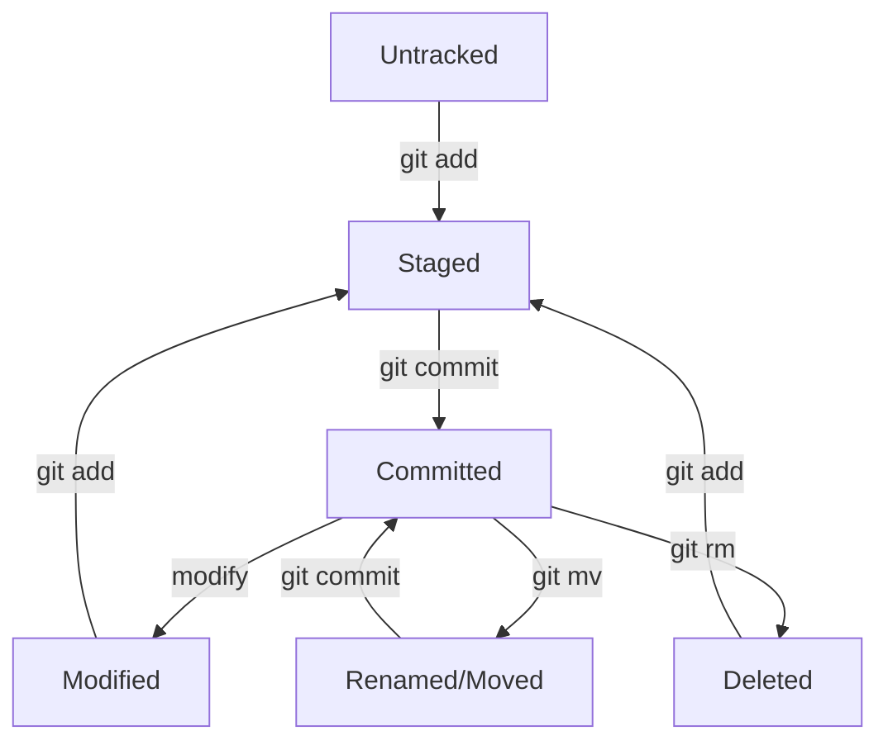

# Working with Files in Git

Git provides powerful tools for managing files throughout their lifecycle. This guide covers adding, modifying, moving, renaming, and deleting files in your Git repository.

## File Lifecycle in Git

Files in a Git repository go through different states:



## Adding New Files

### Creating and Adding Files
```bash
# Create a new file
echo "console.log('Hello World');" > script.js

# Check status
git status

# Add the file to staging
git add script.js

# Commit the file
git commit -m "Add JavaScript file"
```

### Adding Multiple Files
```bash
# Add specific files
git add file1.txt file2.txt file3.txt

# Add all files in current directory
git add .

# Add all files in specific directory
git add src/

# Add files by pattern
git add *.js
git add **/*.css
```

## Modifying Existing Files

### Basic Modification Workflow
```bash
# Modify a file
echo "Updated content" >> existing-file.txt

# Check what changed
git diff

# Stage the changes
git add existing-file.txt

# Commit the changes
git commit -m "Update existing file content"
```

### Viewing Changes
```bash
# See unstaged changes
git diff

# See staged changes
git diff --staged

# See changes in specific file
git diff filename.txt

# See changes between commits
git diff HEAD~1 HEAD
```

## Moving and Renaming Files

### Using Git to Move/Rename
```bash
# Rename a file
git mv old-name.txt new-name.txt

# Move a file to different directory
git mv file.txt src/file.txt

# Move and rename simultaneously
git mv old-file.txt src/new-file.txt

# Commit the changes
git commit -m "Rename and reorganize files"
```

### Manual Move/Rename (Not Recommended)
```bash
# If you moved files manually outside of Git
mv old-file.txt new-file.txt

# Git sees this as deletion and addition
git status

# Stage both operations
git add old-file.txt new-file.txt

# Git will detect the rename
git status
```

## Deleting Files

### Remove File from Git and Filesystem
```bash
# Delete file using Git (removes from both Git and disk)
git rm unwanted-file.txt

# Commit the deletion
git commit -m "Remove unwanted file"
```

### Remove File from Git Only (Keep on Disk)
```bash
# Remove from Git tracking but keep local copy
git rm --cached secret-file.txt

# Add to .gitignore to prevent re-tracking
echo "secret-file.txt" >> .gitignore

# Commit the changes
git add .gitignore
git commit -m "Stop tracking secret file"
```

### Remove Directory
```bash
# Remove directory and all contents
git rm -r old-directory/

# Commit the deletion
git commit -m "Remove old directory"
```

## Practical Examples

### Example 1: Reorganizing Project Structure
```bash
# Current structure:
# project/
# ├── index.html
# ├── style.css
# └── script.js

# Create new structure
mkdir src css js

# Move files using Git
git mv index.html src/
git mv style.css css/
git mv script.js js/

# Check status
git status

# Commit the reorganization
git commit -m "Reorganize project structure"

# Final structure:
# project/
# ├── src/
# │   └── index.html
# ├── css/
# │   └── style.css
# └── js/
#     └── script.js
```

### Example 2: Cleaning Up Old Files
```bash
# Remove multiple obsolete files
git rm old-config.txt deprecated-script.js temp-file.log

# Remove empty directories (Git doesn't track empty dirs)
# But you can remove files that make directories empty
git rm old-dir/last-file.txt

# Commit the cleanup
git commit -m "Clean up obsolete files and directories"
```

### Example 3: Renaming with History Preservation
```bash
# Git automatically tracks renames when using git mv
git mv component.js my-component.js

# Check that Git recognizes it as a rename
git status

# Commit preserves file history
git commit -m "Rename component for clarity"

# View file history (includes pre-rename history)
git log --follow my-component.js
```

## Working with File Permissions

### Executable Files
```bash
# Make file executable
chmod +x script.sh

# Git tracks executable permission
git add script.sh
git commit -m "Make script executable"
```

### Checking File Mode Changes
```bash
# See permission changes
git diff

# Example output shows mode change:
# old mode 100644
# new mode 100755
```

## Handling Special Files

### Large Files
```bash
# For large files, consider Git LFS
git lfs track "*.zip"
git add .gitattributes
git add large-file.zip
git commit -m "Add large file with LFS"
```

### Binary Files
```bash
# Git handles binary files automatically
git add image.png video.mp4 document.pdf
git commit -m "Add binary assets"

# View binary file changes (limited info)
git diff --stat
```

### Symbolic Links
```bash
# Create symbolic link
ln -s target-file.txt link-to-file.txt

# Git tracks the link, not the target
git add link-to-file.txt
git commit -m "Add symbolic link"
```

## File Patterns and Globbing

### Using Wildcards
```bash
# Add all JavaScript files
git add *.js

# Add all files in subdirectories
git add **/*.css

# Add files with specific pattern
git add test-*.js
```

### Advanced Patterns
```bash
# Add all files except specific ones
git add .
git reset HEAD *.log

# Add files in multiple directories
git add src/ tests/ docs/
```

## Restoring Files

### Discard Unstaged Changes
```bash
# Restore specific file to last committed version
git restore filename.txt

# Restore all modified files
git restore .

# Alternative (older syntax)
git checkout -- filename.txt
```

### Restore Deleted Files
```bash
# If file was deleted but not committed
git restore filename.txt

# If file was deleted in a previous commit
git restore --source=HEAD~2 filename.txt
```

### Unstage Files
```bash
# Remove file from staging area
git restore --staged filename.txt

# Remove all files from staging
git restore --staged .
```

## File Status Overview

### Understanding Git Status Output
```bash
git status
```

Output interpretation:
- `??` - Untracked files
- `A` - Added (new file staged)
- `M` - Modified
- `D` - Deleted
- `R` - Renamed
- `C` - Copied
- `U` - Unmerged (conflict)

### Short Status Format
```bash
# Condensed status view
git status -s

# Example output:
# ?? new-file.txt
# M  modified-file.txt
# A  added-file.txt
# D  deleted-file.txt
```

## Best Practices for File Management

### 1. Use Git Commands for File Operations
```bash
# Good: Git tracks the operation
git mv old-name.txt new-name.txt
git rm unwanted-file.txt

# Avoid: Manual operations lose Git tracking
mv old-name.txt new-name.txt
rm unwanted-file.txt
```

### 2. Commit Logical File Groups
```bash
# Good: Related files together
git add header.html header.css
git commit -m "Update header component"

# Good: Feature-complete changes
git add user-model.js user-controller.js user-view.html
git commit -m "Implement user management feature"
```

### 3. Use .gitignore Effectively
```bash
# Create comprehensive .gitignore
cat > .gitignore << EOF
# Dependencies
node_modules/
vendor/

# Build outputs
dist/
build/
*.min.js

# Environment files
.env
.env.local

# Editor files
.vscode/
*.swp

# OS files
.DS_Store
Thumbs.db

# Logs
*.log
logs/
EOF
```

## Troubleshooting File Operations

### File Stuck in Staging
```bash
# Remove from staging but keep changes
git restore --staged filename.txt
```

### Accidentally Deleted File
```bash
# Restore from last commit
git restore filename.txt

# Or restore from specific commit
git restore --source=HEAD~1 filename.txt
```

### Case Sensitivity Issues
```bash
# On case-insensitive systems (Windows/macOS)
git config core.ignorecase false

# Force rename with case change
git mv filename.txt temp.txt
git mv temp.txt FileName.txt
```

## Quick Reference

```bash
# File operations
git add filename.txt          # Stage file
git mv old.txt new.txt       # Rename/move file
git rm filename.txt          # Delete file
git rm --cached file.txt     # Stop tracking file

# Viewing changes
git diff                     # See unstaged changes
git diff --staged            # See staged changes
git status                   # Check file status
git status -s                # Short status format

# Restoring files
git restore filename.txt      # Discard changes
git restore --staged file.txt # Unstage file
git restore --source=HEAD~1 file.txt # Restore from commit

# File history
git log --follow filename.txt # See file history including renames
```

## Next Steps

You now have a solid understanding of file management in Git! Next, let's explore [GitHub integration](../github/overview.md) to learn how to work with remote repositories and collaborate with others.

---

!!! tip "File Management Best Practices"
    - Always use Git commands for file operations when possible
    - Review changes with `git diff` before committing
    - Use meaningful commit messages that describe file changes
    - Keep your `.gitignore` file up to date
