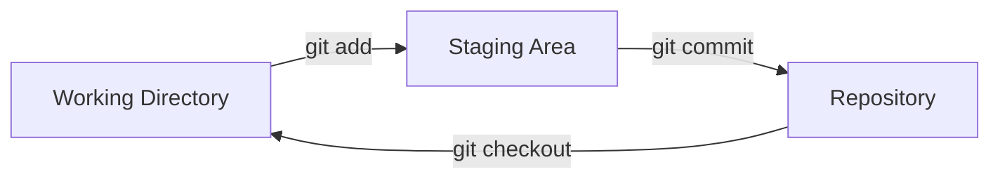
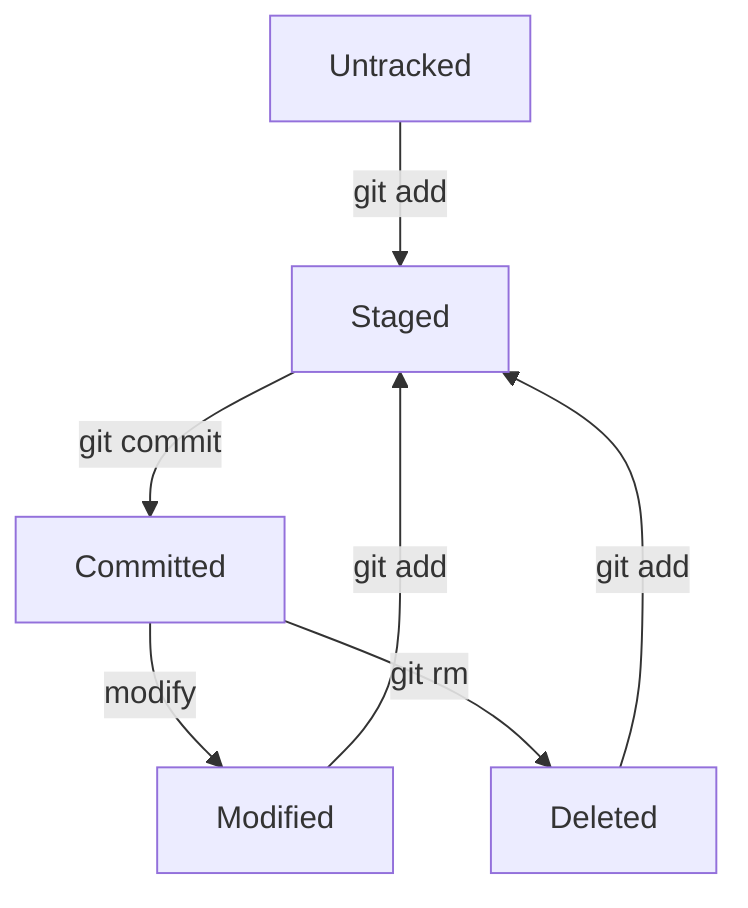

# Git Basics Overview

Now that you have Git installed and configured, let's dive into the fundamental concepts and operations you'll use every day. This section covers the core Git workflow that every developer needs to master.

## The Git Workflow

Understanding the Git workflow is crucial to using Git effectively. Here's the basic flow:



### Three Main Areas

1. **Working Directory** 📁
   - Your project files as you see them
   - Where you make changes and edit files
   - Files can be modified, added, or deleted

2. **Staging Area** 📋
   - A preparation area for your next commit
   - Also called the "index"
   - Contains changes you want to include in your next commit

3. **Repository** 🗃️
   - Your project's complete history
   - Contains all committed changes
   - The `.git` folder in your project

## Core Git Commands

Here are the essential commands you'll use daily:

| Command | Purpose | Example |
|---------|---------|---------|
| `git init` | Initialize a new repository | `git init my-project` |
| `git add` | Stage changes | `git add file.txt` |
| `git commit` | Save staged changes | `git commit -m "Add feature"` |
| `git status` | Check repository status | `git status` |
| `git log` | View commit history | `git log --oneline` |

## File States in Git

Files in your Git repository can be in different states:



### File State Descriptions

- **Untracked** 🆕: New files that Git doesn't know about
- **Staged** 📋: Changes marked to be included in the next commit
- **Committed** ✅: Changes saved in the repository
- **Modified** ✏️: Tracked files that have been changed
- **Deleted** 🗑️: Files that have been removed

## Basic Workflow Example

Let's walk through a typical Git workflow:

```bash
# 1. Create a new project
mkdir my-project
cd my-project

# 2. Initialize Git repository
git init

# 3. Create a file
echo "Hello Git!" > README.md

# 4. Check status
git status

# 5. Stage the file
git add README.md

# 6. Commit the changes
git commit -m "Add README file"

# 7. View the history
git log
```

## Understanding Git Status

The `git status` command is your best friend. It shows:

- **Red files** 🔴: Untracked or modified files (not staged)
- **Green files** 🟢: Staged files (ready to commit)
- **Clean working tree**: No changes to commit

Example output:
```
On branch main
Changes to be committed:
  (use "git restore --staged <file>..." to unstage)
        new file:   README.md

Changes not staged for commit:
  (use "git add <file>..." to update what will be committed)
        modified:   index.html

Untracked files:
  (use "git add <file>..." to include in what will be committed)
        config.txt
```

## What's Next?

Now that you understand the basic concepts, let's dive deeper into each operation:

1. **[Repository Initialization](initialization.md)** - Creating your first repository
2. **[Staging Changes](staging.md)** - Preparing files for commit
3. **[Committing Changes](committing.md)** - Saving your work
4. **[Working with Files](files.md)** - Managing files in Git

## Quick Reference Card

!!! tip "Essential Commands Cheat Sheet"
    ```bash
    # Check what's happening
    git status
    
    # Stage files
    git add filename.txt    # Stage specific file
    git add .              # Stage all changes
    
    # Commit changes
    git commit -m "message"  # Commit with message
    git commit -a -m "msg"   # Stage and commit modified files
    
    # View history
    git log                # Full log
    git log --oneline      # Condensed log
    
    # Undo changes
    git restore filename   # Discard changes
    git restore --staged filename  # Unstage file
    ```

Ready to create your first repository? Let's start with [repository initialization](initialization.md)!
